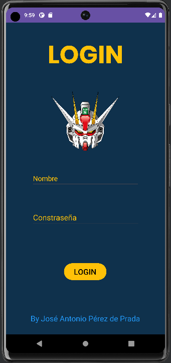
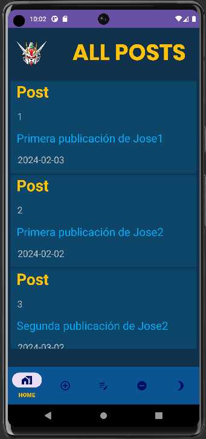

# PROYECTO 2ª EVALUACIÓN DE MULTIMEDIA
*Este proyecto ha sido desarrollado por José Antonio Pérez de Prada*

Para este proyecto se ha utilizado la API de Twitter que se usará también para Acceso a Datos y que puede encontrarse en el repositorio de github de este proyecto.

## ACTIVIDADES DE LA APLICACIÓN
La aplicación cuenta con 2 actividades:
- La actividad de Login:

- La actividad Main

### Actividad de Login
Es la que permite al usuario acceder a la actividad Main mediante un usuario registrado en la API.
Si el usuario y la contraseña son correctos, se mostrará el siguiente mensaje de Toast:

Si no es correcto el inicio de sesión, no se pasará a la siguiente actividad y se mostrará este mensaje:

