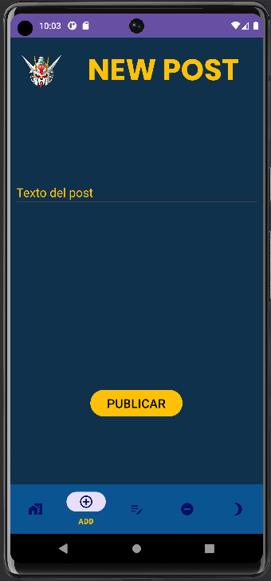
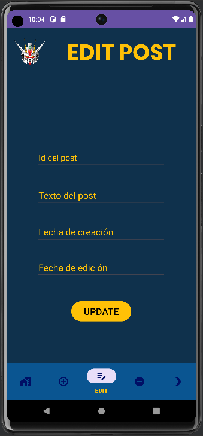
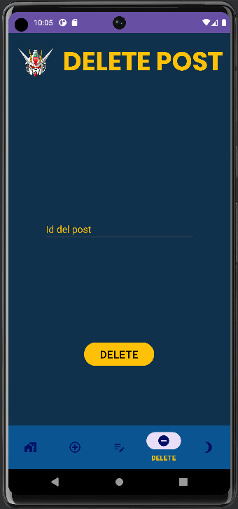
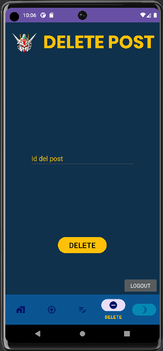

# PROYECTO 2ª EVALUACIÓN DE MULTIMEDIA
*Este proyecto ha sido desarrollado por José Antonio Pérez de Prada*

Para este proyecto se ha utilizado la API de Twitter que se usará también para Acceso a Datos y que puede encontrarse en el repositorio de github de este proyecto.

# ACTIVIDADES DE LA APLICACIÓN
La aplicación cuenta con 2 actividades:
- La actividad de Login:

- La actividad Main

## Actividad de Login
Es la que permite al usuario acceder a la actividad Main mediante un usuario registrado en la API.
Si el usuario y la contraseña son correctos, se mostrará el siguiente mensaje de Toast:

Si no es correcto el inicio de sesión, no se pasará a la siguiente actividad y se mostrará este mensaje:

Como se puede observar, la actividad cuenta con:
- Un TextView: LOGIN.
- Una imagen.
- Dos TextInput para introducir el nombre del usuario y su contraseña.
- Un botón para realizar el evento de inicio de sesión.
- Un TextView: By José ANtonio Pérez de Prada.

## Actividad Main
Es la que contiene los fragments de la aplicación.
Cuenta con un **fragmentContainerView** y un **bottomNavigationView** con los cuales se muestran y controlan los fragments respectivamente.
En el **bottomNavigationView** pueden verse los siguientes botones:

- **Home**: que nos lleva al fragment principal.
- **Add**: que nos lleva al fragment de añadir publicaciones.
- **Edit**: que nos lleva al fragment de editar una publicación.
- **Delete**: que nos lleva al fragment de borrar una publicación.
- **Logout**: que nos lleva de vuelta a la actividad de Login.

### Fragment principal para visualizar las publicaciones

Contiene tanto una imagen, un título y la lista que muestra las cartas con la información de las publicaciones (id, texto y fecha).

### Fragment para crear una publicación

Contiene un TextInput para introducir el texto de la publicación y un botón para crear la publicación.

### Fragment para editar una publicación

Contiene los TextInput para el id de la publicación, el texto de la publicación, la fecha de creación y la de edición y el botón para actualizar la información de la publicación.

### Fragment para crear una publicación

Contiene un TextInput para el id de la publicación que se desea borrar y el botón para ejecutar dicha acción.

### Botón de Logout

Como se ha mencionado anteriormente, el quinto botón lo que hace es enviarnos de vuelta a la actividad de Login, donde el usuario deberá iniciar sesión de nuevo.

Para el funcionamiento del consumo de la API se ha tenido que utilizar dos métodos GET que obtenían tanto todas las publicaciones como los usuarios para poder iniciar sesión con cualquier de los registrados, un método POST, un método PUT y un método DELETE.